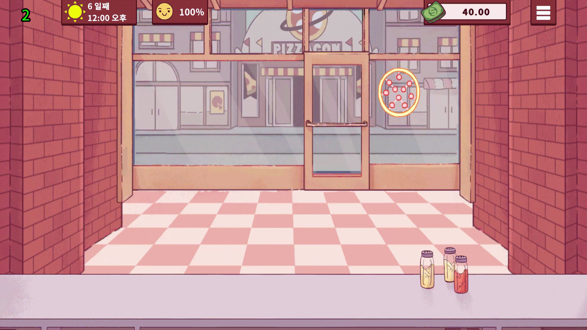
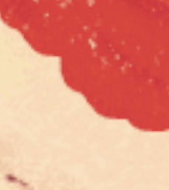
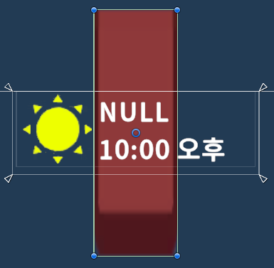
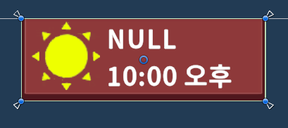

# 좋은 피자, 위대한 피자 모작

🛠️ **개발 도구**

 

📅 **개발 기간**

2025.01.21 ~ 2025.02.14 (4주)

💂‍♂️ **팀 구성**

 - 개발 : 황규영
 - 기획 : 김용광

피자 가게 타이쿤 게임 좋은 피자, 위대한 피자를 모작한 프로젝트입니다.
**좋은 피자, 위대한 피자**의 리소스를 활용했습니다.

---

## 🛠️ 주요 구현 요소

### NPC 대화창

### 브러시를 이용한 그리기 객체 및 부드러운 경계

### 스프라이트 텍스쳐 회전

### 튜토리얼
